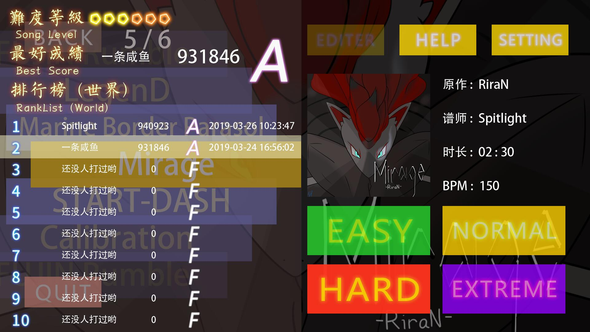
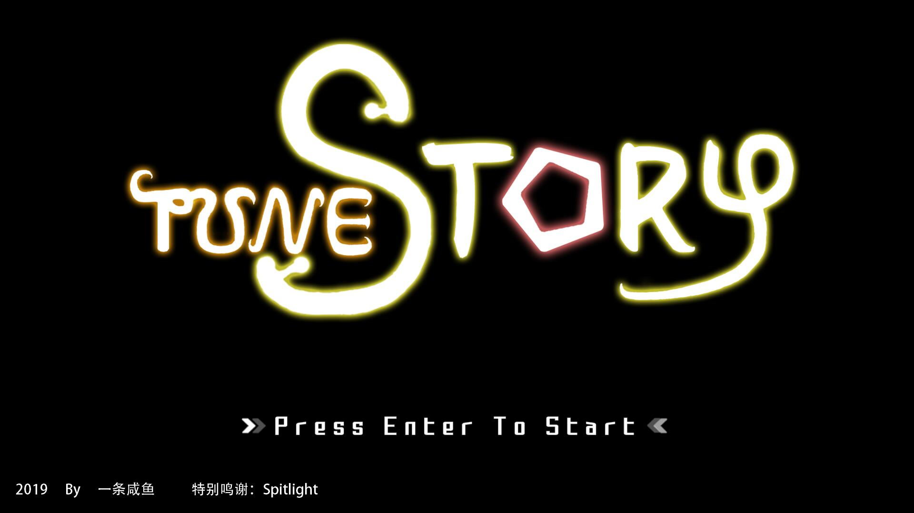
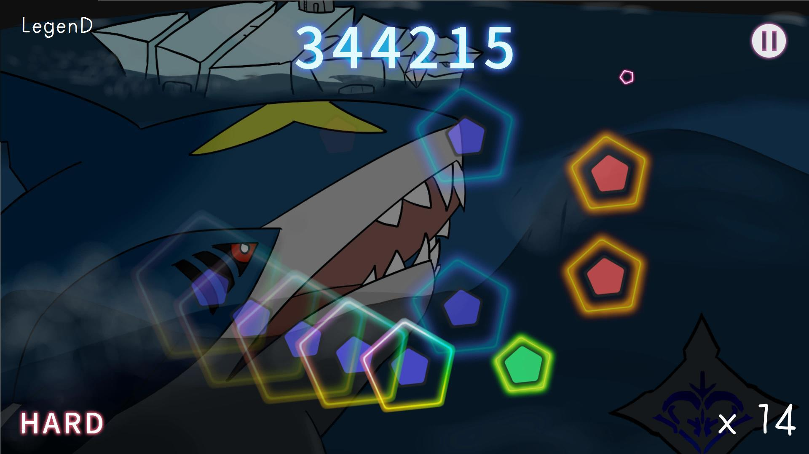
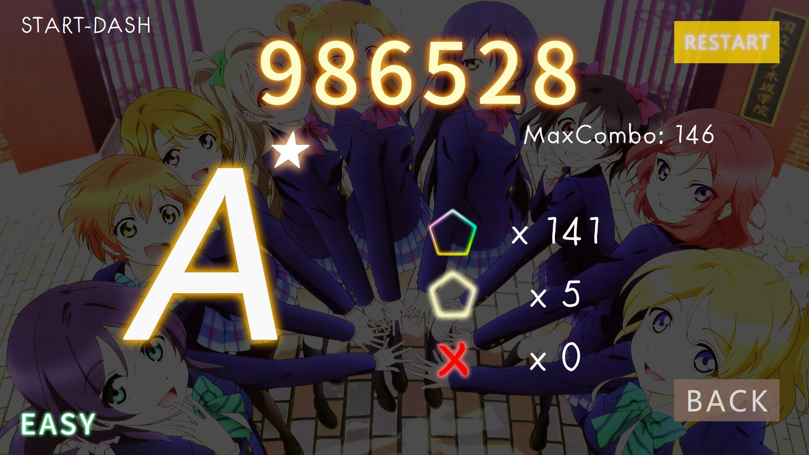
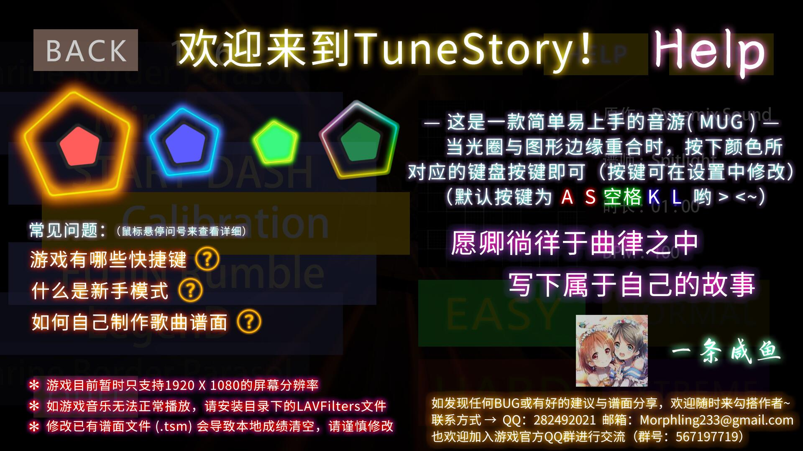
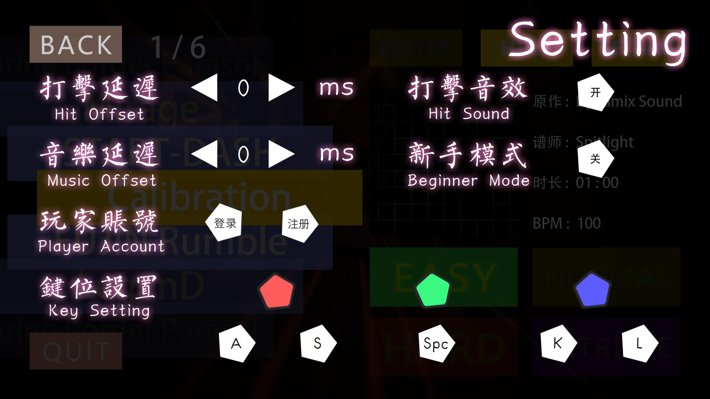

## TuneStory

A tiny Music Game developped by **Qt**

The game only runs at **1920 * 1080** resolution and the platform of Windows.

You can make your own song charts in this game, and the guide is included in the **制谱指南.txt**

Currently the game server is down, so the user system and leaderboards are not available now. You can still play with the single game.

### Screenshots

### Trial Play Video

You can check it on bilibili:

 [[TuneStory] FUJIN Rumble Hard lv.08 Trial Play](https://www.bilibili.com/video/BV1xb411v7Ko)

### Others

Thanks to Spitlight for helping me test the game throughout and recording the Trial Play Video.

Thanks to all the players who participated in the playtest.

